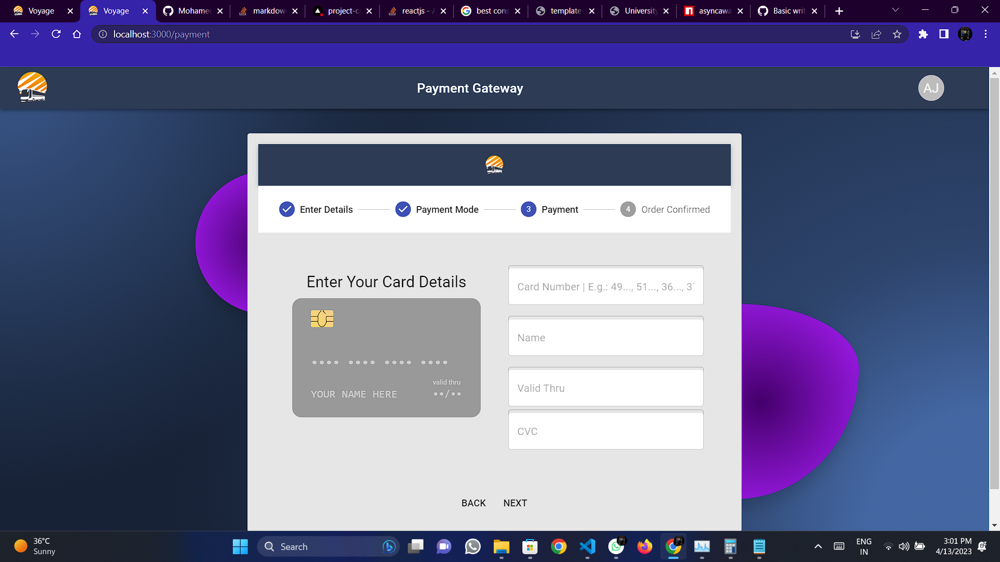

# Voyage
### Codename [Project Cargo]

## Project Description

This is is my final year academic project build using React.js and firebase. Voyage is a one stop destination to all your bus related queries. It is build with the concept of bringing together the private bus services and Government Owned Bus services under one roof. Voyage can help you book a ticket whether its private or not.It also gives you the ability to Track your booked bus, Voyage Uses Gps enabled tracking,resulting in accurate tracking of your booked bus,informing you if the bus service has started,late or has been cancelled. The user can cancel,view the booked tickets and track the booked bus after loggin in.
 

## Libraries used

build on React.js Version 18.2.0
Backend: firebse Version 9.17.1
Styling: tailwind css, scss, css
Others:
react-leaflet
Bing Services
Material Ui
React Bootstrap
Open Street Maps(Transport Layer)
Overpass Turbo
etc...

## Team members

1. Alan Jacob [https://github.com/alanjacob-exe]
2. Ashhad Biju [https://github.com/AshhadBiju]
3. Gopika 
4. Sreelakshmi 

## Available Scripts

In the project directory, you can run:

### `npm start`

Runs the app in the development mode.\
Open [http://localhost:3000](http://localhost:3000) to view it in your browser.

The page will reload when you make changes.\
You may also see any lint errors in the console.

### `npm test`

Launches the test runner in the interactive watch mode.\
See the section about [running tests](https://facebook.github.io/create-react-app/docs/running-tests) for more information.

### `npm run build`

Builds the app for production to the `build` folder.\
It correctly bundles React in production mode and optimizes the build for the best performance.

The build is minified and the filenames include the hashes.\
Your app is ready to be deployed!

See the section about [deployment](https://facebook.github.io/create-react-app/docs/deployment) for more information.

### `npm run eject`

**Note: this is a one-way operation. Once you `eject`, you can't go back!**

If you aren't satisfied with the build tool and configuration choices, you can `eject` at any time. This command will remove the single build dependency from your project.

Instead, it will copy all the configuration files and the transitive dependencies (webpack, Babel, ESLint, etc) right into your project so you have full control over them. All of the commands except `eject` will still work, but they will point to the copied scripts so you can tweak them. At this point you're on your own.

You don't have to ever use `eject`. The curated feature set is suitable for small and middle deployments, and you shouldn't feel obligated to use this feature. However we understand that this tool wouldn't be useful if you couldn't customize it when you are ready for it.

## Photos of the Project

Homescreen

Bus Search

Seat Selection

Payment Gateway

After Loggin in

